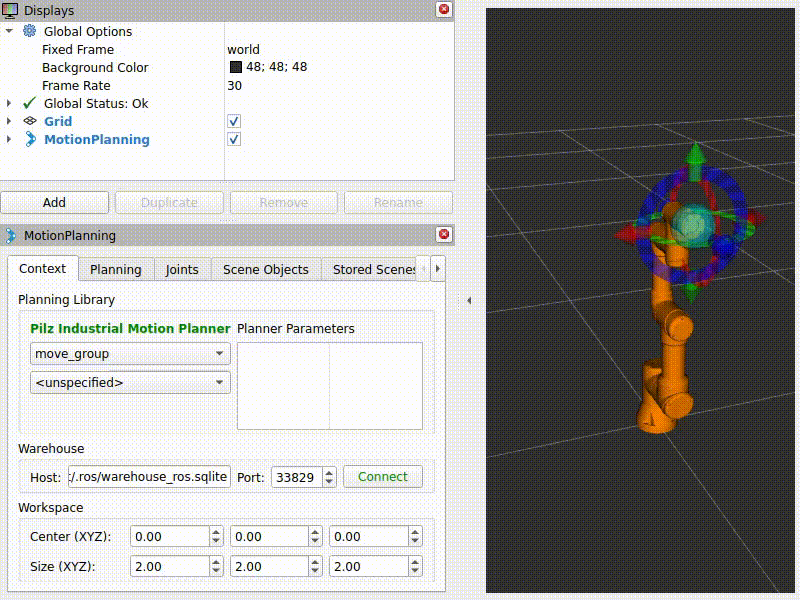

# ur_pilz_demo
Demonstration of Pilz Industrial Motion Planner in MoveIt with Universal Robots


<p align="center">
    
    </br>
    <sup>Sample video showing demonstration on RViz</sup>
</p>


## Dependencies
* [MoveIt 2](https://moveit.ros.org/install-moveit2/binary/): Install using the following command: 
    ```console
    $ sudo apt install ros-${ROS_DISTRO}-moveit
    ```
* [Universal Robots ROS2 Driver](https://github.com/UniversalRobots/Universal_Robots_ROS2_Driver): Install using the following commands: 
    ```console
    $ sudo apt install ros-${ROS_DISTRO}-ur-robot-driver
    $ sudo apt install ros-${ROS_DISTRO}-ur-moveit-config
    ```
* [MoveIt Visual Tools](https://github.com/ros-planning/moveit_visual_tools): Install using the following command: 
    ```console
    $ sudo apt install ros-${ROS_DISTRO}-moveit-visual-tools
    ```


## Compilation
1. Make sure to download complete repository. Use `git clone` or download zip as per convenience.
2. Invoke `colcon` tool inside ros workspace i.e., `colcon build`


## Steps to run
1. Start UR ROS 2 driver in simulation mode by using the following command:
    ```console
    $ ros2 launch ur_robot_driver ur3e.launch.py robot_ip:=yyy.yyy.yyy.yyy \
      use_fake_hardware:=true launch_rviz:=false \
      initial_joint_controller:=scaled_joint_trajectory_controller
    ```
2. Invoke the demo by using the following command:
    ```console
    $ ros2 launch ur_pilz_demo ur_pilz.launch.py 
    ```


## Note
This package has been tested on the following environment configuration-

| Name                         | Value                                  |
| ---------------------------- | -------------------------------------- |
| ROS                          | Humble                                 |
| MoveIt 2                     | 2.5.5-1                                |
| Universal Robots ROS2 Driver | 2.2.9-1                                |
| MoveIt Visual Tools          | 4.1.0-1                                |
| OS                           | Ubuntu 22.04.3 LTS (64-bit)            |
| Kernel                       | Version 6.2.0-35-generic               |
| GCC                          | Version 11.4.0                         |
| Python                       | Version 3.10.12                        |
| RAM                          | 8 GB                                   |
| Processor                    | Intel® Core™ i7-7700 CPU @ 3.60GHz × 8 |


## Issues (or Error Reporting) 
Please check [here](https://github.com/ravijo/ur_pilz_demo/issues) and create issues accordingly.


## References
* [MoveIt Resources](https://github.com/ros-planning/moveit_resources)
* [Universal Robots ROS2 Description](https://github.com/UniversalRobots/Universal_Robots_ROS2_Description)
* [Universal Robots ROS2 Driver](https://github.com/UniversalRobots/Universal_Robots_ROS2_Driver)

  
